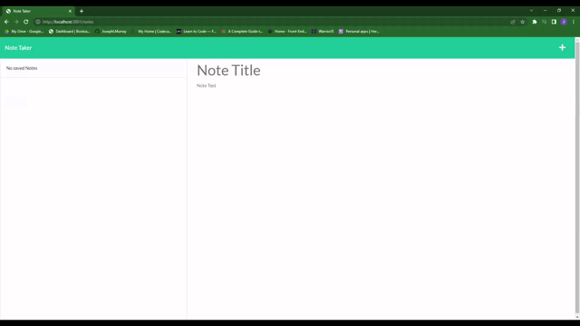

# Note Taker

## Description

A simple note taking app that stores data to a server and accepts text input, titles, and supports deletion.

## Table of Contents

- [Installation](#installation)
- [Usage](#usage)
- [Credits](#credits)
- [License](#license)

## Installation

npm install

## Usage

Visit the link [Link] for the hosted page.

[Demo Video link](https://drive.google.com/file/d/1pGDrEpK5QMw05F_JVJgXClCWHDvyvY8A/view)

## Tests

There are currently no tests for this app.

## Author

GitHub: [github.com/JosephLMurray](github.com/JosephLMurray)

Email: [josephl.murrayjr@gmail.com](josephl.murrayjr@gmail.com)

## License

This product is licensed under GPL 3.0

[https://opensource.org/licenses/GPL 3.0](https://opensource.org/licenses/GPL-3.0)
